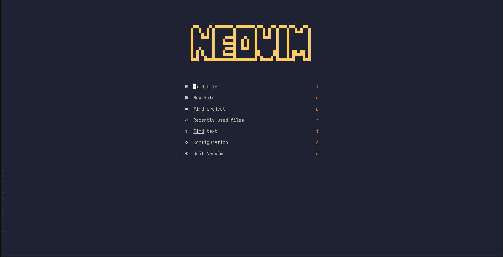

# My Cool Neovim Setup

This setup is made with these plugins:

```alpha```,
```autocommands```,
```autopairs```,
```bufferline```,
```cmp```,
```colorscheme: Shatur/neovim-ayu```,
```gitsigns```,
```impatient```,
```indentline```,
```keymaps```,
```lualine```,
```nvim-tree```,
```telescope```,
```toggleterm```,
```treesitter```,
```whichkey```

## Installation Steps

### Neovim Installation Steps

First you need nvim installed.
You can do that with ```scoop``` in windows or ```apt```/```pacman``` in Debian or Arch Linux.
With scoop: ```scoop install neovim```
With apt: ```sudo apt install neovim```
With pacman: ```sudo pacman -S neovim```

### Configuration Steps

Clone this repository:

Windows: ```git clone https://github.com/Abdullah-coder2013/CoolNeovimSetup.git $HOME/Appdata/Local/nvim```
Linux: ```git clone https://github.com/Abdullah-coder2013/CoolNeovimSetup.git ~/.config/nvim```

Then, run ```nvim```
In Neovim run ```:PackerSync``` if the PackerSync menu doesn't appear automatically.
Reload Neovim and it should have a new look like this:


